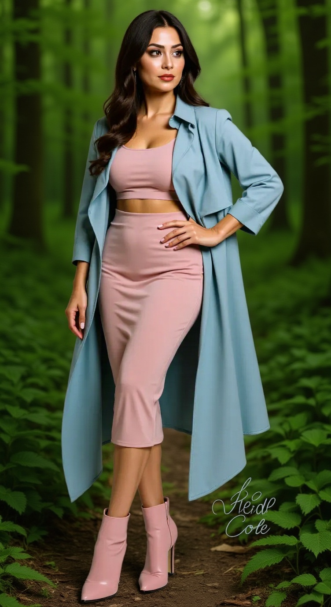

# FLUX.1-Kontext-dev-Training

This repository contains the code for training **FLUX.1-Kontext-dev**, an advanced instruction-based image editing model. This variant is specifically trained to generate realistic, high-quality edits to masked regions of images based on natural language prompts. It excels at:

## 🧠 Key Features

- ✏️ **Instruction-guided editing** — modify masked regions with just a text prompt  
- 💡 **Character & style referencing** — consistent outputs without fine-tuning  
- 🔁 **Multi-step consistency** — supports successive edits with minimal drift  
- ⚡ **Efficient inference** — trained using guidance distillation  
- 🔓 **Open weights** — under a non-commercial license for research and creative use

---

FLUX.1-Kontext-dev is ideal for:

- Visual content generation and revision  
- Fashion and product photoshoot post-processing  
- Creative and commercial visual storytelling  
- Rapid iteration of ideas for designers and artists

Unlike traditional editing or cut-and-paste tools, FLUX.1-Kontext-dev uses advanced diffusion models trained with guidance distillation to deliver high-quality, semantically-aligned edits from text instructions and masks.

---

## Setup and Installation

### Dependencies

```bash
# Clone the repository
git clone https://github.com/your-username/FLUX.1-Kontext-dev-Training.git
cd FLUX.1-Kontext-dev-Training

# Install dependencies
pip install accelerate transformers diffusers wandb
```
## Environment Setup

Make sure you have access to the following:
- A GPU with 80GB VRAM (H100 recommended)
- Required datasets: "raresense/BGData" and "raresense/BGData_Validation" available on Hugging Face

### Training Instructions

### Configuration

The main training script `train_model.sh` contains key variables that you can modify:

```bash
# Main data columns
export SOURCE_COLUMN="ghost_images"  # Column containing source images
export TARGET_COLUMN="target"        # Column containing target images
export CAPTION_COLUMN="prompt"       # Column containing text prompts

# Model and dataset configuration
export MODEL_NAME="black-forest-labs/FLUX.1-Kontext-dev"
export TRAIN_DATASET_NAME="raresense/Jewelry"
export VAL_DATASET_NAME="raresense/Jewelry_test"
export OUTPUT_DIR="Lora_Training_Kontext_dev"
```

### Running Training

To start training:

```bash
# Make sure the script is executable
chmod +x train_model.sh

# Run the training script
./train_model.sh
```

### Resume Training

To resume training from a checkpoint, uncomment the following line in `train_model.sh`:

```bash
# --resume_from_checkpoint="latest"  \
```

## Training Results

Below are examples of the model's performance before and after fine-tuning.

### Example 1: Desighner Sketch to Image

| Source Image | Generated Output | Prompt |
|:------------:|:---------------------:|:----------------:|
|  |  | Convert this sketch to realistic image |

### Example 2: Background Changer

| Source Image | Generated Output | Prompt |
|:------------:|:---------------------:|:----------------:|
|  |  | Replace the background with Green Forest |

### Example 3: Garment Mask Only

| Source Image | Generated Output | Prompt |
|:------------:|:---------------------:|:----------------:|
|  |  | Replace the background with Green Forest |

## Model Inference

After training, you can use the model for inference:

```python
import torch
from diffusers import FluxKontextPipeline
from diffusers.utils import load_image

pipe = FluxKontextPipeline.from_pretrained("black-forest-labs/FLUX.1-Kontext-dev", torch_dtype=torch.bfloat16)
pipe.load_lora_weights("path/to/train/model/pytorch_lora_weights.safetensors")
pipe.to("cuda")

input_image = load_image("path/to/image.png")

image = pipe(
  image=input_image,
  prompt="Add a hat to the cat",
  guidance_scale=2.5,
  generator=torch.Generator().manual_seed(42),
).images[0]
image.save("output.png")
